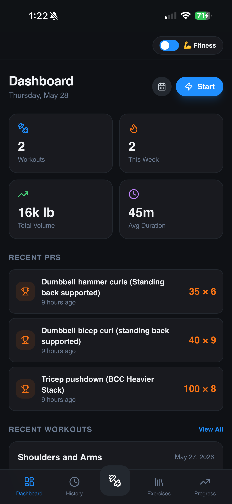
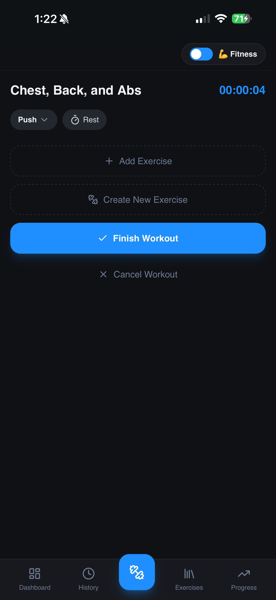
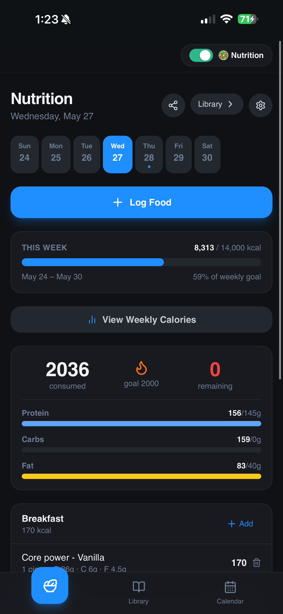
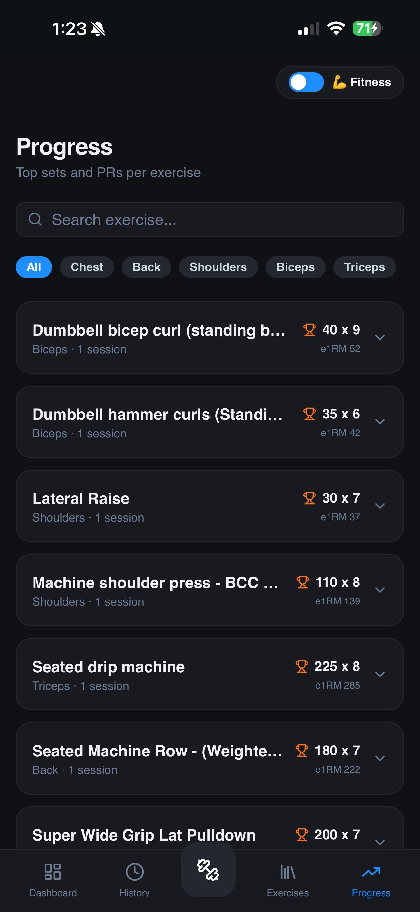
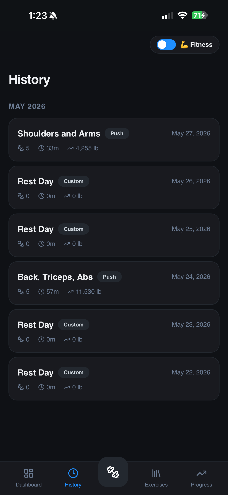
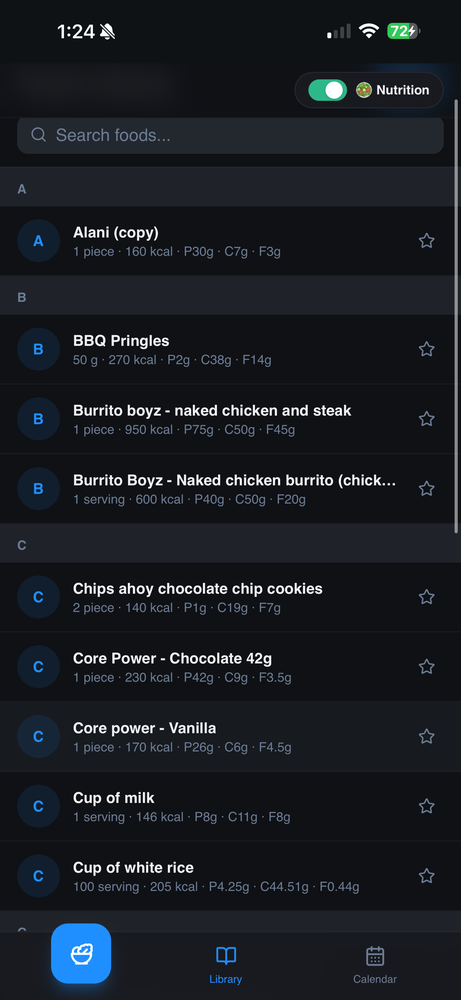
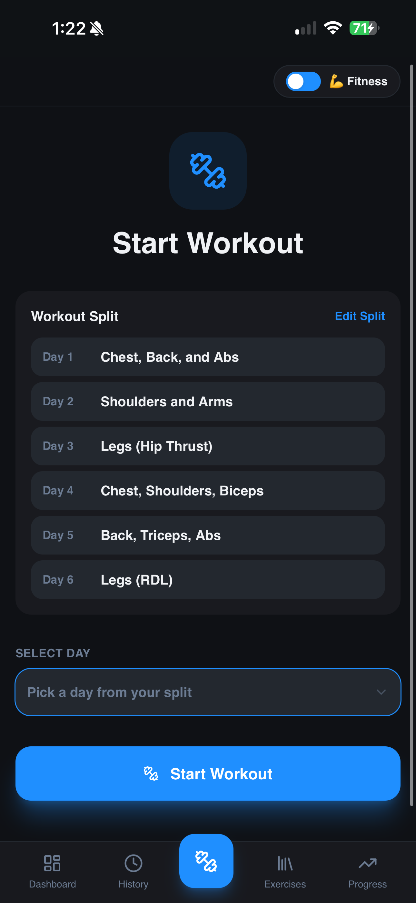

# Progresso AI Fitness Analytics Platform

Advanced fitness analytics platform designed to provide athlete-style workout tracking, nutrition management, progression analysis, and long-term performance visualization for everyday users.

---

## Features

* Real-time workout tracking
* Nutrition and calorie management
* Exercise progression analytics
* Personal record (PR) tracking
* Workout history and calendar systems
* Athlete-style performance dashboards
* Weekly and historical analytics visualization
* Responsive mobile-first UI architecture
* Custom workout split management
* Live workout session tracking
* Exercise library and food database systems

---

## Tech Stack

### Frontend

* React
* Vite
* Tailwind CSS
* React Router
* React Query

### Analytics & Visualization

* Recharts

### Platform Features

* Authentication systems
* Database-backed user management
* Responsive state-driven UI systems
* Workout and nutrition tracking workflows
* Performance analytics dashboards

---

## Screenshots

### Dashboard

### Workout Tracking

### Nutrition Tracking

### Progress Analytics

### Workout History

### Workout Calendar

### Food Library

### Workout Split System

---

## Purpose

Progresso was built to give everyday gym users access to athlete-style analytics, performance tracking, and progression insights similar to the data visibility available to professional athletes and advanced fitness platforms.

The platform focuses on combining intuitive user experience design with scalable analytics-driven fitness workflows to improve long-term user engagement, workout consistency, and performance tracking.

---

## Architecture

The application uses a component-based frontend architecture with structured state management, analytics visualization systems, responsive mobile workflows, and scalable tracking interfaces designed for long-term fitness data analysis and user progression tracking.

Core systems include:

* Workout tracking engine
* Nutrition analytics system
* Performance visualization dashboards
* Workout history management
* Calendar-based progression tracking
* Personal record (PR) analytics
* User workflow and split management systems

---

## Future Development

Planned future improvements include:

* AI-generated workout recommendations
* Smart progression analysis
* Recovery and fatigue tracking
* Social and community features
* Advanced athlete analytics dashboards
* Wearable device integration
* AI-powered nutrition insights
